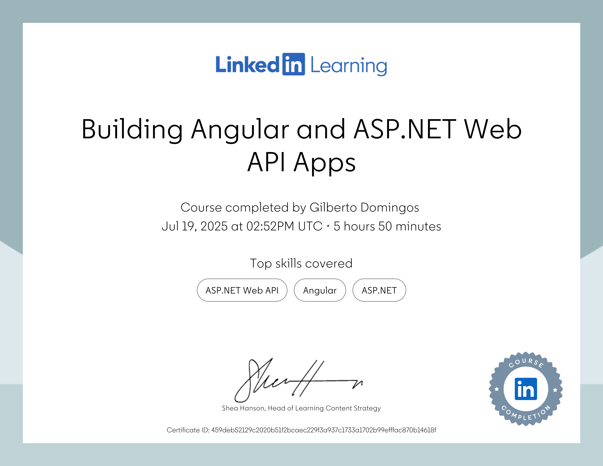

# Building Angular and ASP.NET Core Web API Apps
This is the repository for the LinkedIn Learning course Building Angular and ASP.NET Web API Apps. The full course is available from [LinkedIn Learning][lil-course-url].

![lil-thumbnail-url]

## Conteúdo :

### Back-end

- Projeto ASP.NET Core Web API
- Definiçao dos modelos de aplicação
- Configuração do Entity Framework para acesso ao banco de dados
- Endpoint de criação (Create)
- Endpoint de leitura de todos os registros (Read-all)
- Endpoint de leitura por ID (Read by ID)
- Endpoint de atualização (Update)
- Endpoint de exclusão (Delete)
- Realização da limpeza do código

### Front-end

- Projeto Angular
- Definição e criação de componentes 
- Configuração de rotas e navegação
- Criação do serviço de transações com métodos HTTP
- Projetar o cabeçalho e o rodapé da aplicação
- Desenvolvimento da página de listagem
- Load de dados da API de administração
- Formulários
- Transação enviando dados via HTTP POST
- Atualização de dados da transação com HTTP PUT
- Exclusão de transação com HTTP DELETE

### Autenticação e Token

- Autenticação Baseada em Token
- Configuração de autenticação baseada em tokens no ASP.NET Web API
- Endpoint de registro na API
- Endpoint de login na API
- Serviço de autenticação no Angular
- Registrar um novo usuário
- Validação de dados ao formulário de registro
- Realizar login em uma conta
- Proteger rotas usando Angular Guards
- Atualizar o cabeçalho para a funcionalidade de logout
- Interceptor de autenticação
- Definição  do ID do usuário ao criar e carregar uma transação

### Deploy da Aplicação na Azure
- Explorar os serviços da Azure para deploy
- Fazer o deploy da aplicação Angular usando Azure Static Website
- Fazer o deploy do banco de dados SQL no Azure SQL Database Services
- Fazer o deploy da ASP.NET Web API usando Azure App Services

## Course Description

This course provides a practical guide to building modern full-stack web applications using ASP.NET Web API and Angular. Learn how to create and secure RESTful API endpoints, integrate them with an Angular frontend, and perform essential CRUD operations. Along the way, instructor Ervis Trupja covers best practices for designing scalable and maintainable applications, including authentication using JSON Web Tokens. By the end of the course, you should also understand how to deploy your applications to production environments, ensuring they are ready for real-world use. This course is perfect for developers who are just getting started or they want to improve their full-stack development skills using these powerful frameworks.

_See the readme file in the main branch for updated instructions and information._
## Instructions
This repository has branches for each of the videos in the course. You can use the branch pop up menu in github to switch to a specific branch and take a look at the course at that stage, or you can add `/tree/BRANCH_NAME` to the URL to go to the branch you want to access.

## Branches
The branches are structured to correspond to the videos in the course. The naming convention is `CHAPTER#_MOVIE#`. As an example, the branch named `02_03` corresponds to the second chapter and the third video in that chapter. 
Some branches will have a beginning and an end state. These are marked with the letters `b` for "beginning" and `e` for "end". The `b` branch contains the code as it is at the beginning of the movie. The `e` branch contains the code as it is at the end of the movie. The `main` branch holds the final state of the code when in the course.

When switching from one exercise files branch to the next after making changes to the files, you may get a message like this:

    error: Your local changes to the following files would be overwritten by checkout:        [files]
    Please commit your changes or stash them before you switch branches.
    Aborting

To resolve this issue:
	
    Add changes to git using this command: git add .
	Commit changes using this command: git commit -m "some message"

## Instructor

Ervis Trupja

Full-Stack .NET Web Developer with a mathematical background

[0]: # (Replace these placeholder URLs with actual course URLs)

[lil-course-url]: https://www.linkedin.com/learning/building-angular-and-asp-dot-net-web-api-apps-25808138
[lil-thumbnail-url]: https://media.licdn.com/dms/image/v2/D4E0DAQE3RQBOQa0_aw/learning-public-crop_675_1200/B4EZZAo1qJHYAg-/0/1744841169841?e=2147483647&v=beta&t=mV3ZhRi5GnUkHa4Ozgom8mZRpPW8fY7J4ZV_nU9JLkI

